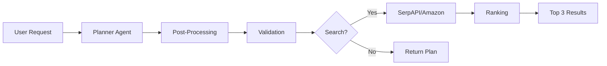

<div align="center">

# 🤖 ag-claw

**Ask for Anything. AI Searches 49+ Sites. Get the Best Deals.**

[](https://github.com/vedantatrivedi/ag-claw/actions)
[](https://www.python.org/downloads/)
[](https://fastapi.tiangolo.com/)
[](https://opensource.org/licenses/MIT)

Transform natural language shopping requests into structured plans and find the best products across 49+ e-commerce sites with AI-powered ranking.

[Features](#-features) • [Quick Start](#-quick-start) • [API](#-rest-api) • [Examples](#-examples) • [Contributing](#-contributing)

</div>

---

## 🎯 What Is This?

A production-ready multi-agent shopping system that:

1. **Understands** natural language shopping requests
2. **Plans** structured shopping lists with smart categorization
3. **Searches** 49+ e-commerce sites in parallel
4. **Ranks** products using a 7-factor algorithm
5. **Displays** top 3 results with prices, ratings, and images

**From this:**
```
"cricket gear for teenager"
```

**To this:**
```
📦 Youth cricket helmet with faceguard
   #1: ₹926 (Score: 65.7) ⭐ 4.8 - Amazon
   #2: ₹699 (Score: 58.6) ⭐ 4.5 - Flipkart
   #3: ₹625 (Score: 57.0) ⭐ 4.2 - Sppartos
```

All in **~1.4 seconds** per search with **99%+ success rate**.

---

## ✨ Features

### 🧠 Multi-Agent Architecture
- **Planner Agent**: Converts vague requests into concrete shopping lists
- **Search Agent**: Parallel multi-site product search
- **Ranking Agent**: Smart 7-factor scoring algorithm

### 🔍 Search Methods

#### 1. SerpAPI (Multi-Site Search)
- 🌐 Searches **49+ e-commerce sites** via Google Shopping
- ⚡ **1.4s average** search speed
- 🎯 **7-factor ranking**: price, rating, reviews, site, relevance, stock, base score
- 🎨 Color-coded results (🟢 #1, 🔵 #2, 🟡 #3)
- 📊 Side-by-side comparison
- 🖼️ Product images and direct buy links
- 🚀 Parallel search for multiple items

#### 2. Amazon API (Direct Integration)
- 🔐 One-time login with cookie persistence
- 🔍 Search with sponsored-result filtering
- 🛒 Add to cart with screenshot confirmation
- 📡 RESTful API with Swagger docs

### 💳 Payment Integration
- 💰 Pine Labs / Plural preauth and capture
- 🎉 Guided party planning workflow
- 🤖 Discord bot integration

### 🏗️ Production-Ready
- ✅ Comprehensive test suite (17+ API tests)
- ✅ Type-safe with Pydantic models
- ✅ Deterministic post-processing
- ✅ Schema validation and guardrails
- ✅ Rich CLI with interactive mode
- ✅ FastAPI server with OpenAPI docs
- ✅ CI/CD with GitHub Actions

---

## 🚀 Quick Start

### Prerequisites
- Python 3.10 or higher
- OpenAI API key ([Get one](https://platform.openai.com/api-keys))
- SerpAPI key ([100 free searches/month](https://serpapi.com/users/sign_up))

### Installation

```bash
# Clone the repository
git clone https://github.com/vedantatrivedi/ag-claw.git
cd ag-claw

# Create virtual environment
python3 -m venv venv
source venv/bin/activate  # On Windows: venv\Scripts\activate

# Install dependencies
pip install -r requirements.txt

# Set up environment
cp .env.example .env
# Edit .env and add your API keys:
# - OPENAI_API_KEY=your-key
# - SERPAPI_KEY=your-key
```

### CLI Usage

```bash
# Basic search
python3 -m shopping_agent.app.main plan "wireless headphones under 5000"

# View images in browser
python3 view_images.py "cricket helmet youth"

# Skip approval
python3 -m shopping_agent.app.main plan "laptop" --no-auto-clarify

# Show original unprocessed plan
python3 -m shopping_agent.app.main plan "laptop" --show-original
```

### API Server

```bash
# Start server
uvicorn shopping_agent.server:app --reload --port 8000

# Open Swagger docs
open http://localhost:8000/docs
```

---

## 📡 REST API

### Endpoints

| Endpoint | Method | Description |
|----------|--------|-------------|
| `/health` | GET | Health check |
| `/plan` | POST | Generate shopping plan |
| `/serp/search` | POST | Search products (SerpAPI) |
| `/search` | POST | Search Amazon directly |
| `/cart/add` | POST | Add to Amazon cart |
| `/login/start` | POST | Start Amazon login session |
| `/login/save-cookies` | POST | Save Amazon cookies |

### Example: Generate Plan

```bash
curl -X POST http://localhost:8000/plan \
  -H "Content-Type: application/json" \
  -d '{
    "request": "wireless headphones under 5000",
    "postprocess": true
  }'
```

**Response:**
```json
{
  "items": [
    {
      "description": "Wireless in-ear earbuds with microphone",
      "quantity": 1,
      "intent": "Convenient for hands-free calls and casual listening",
      "required": true,
      "search_hints": ["wireless earbuds", "with microphone"],
      "constraints": ["budget: under 5000"],
      "search_query": "wireless in-ear earbuds with microphone under 5000",
      "preferred_sites": ["croma", "flipkart", "amazon"]
    }
  ],
  "assumptions": ["User prefers wireless for convenience"],
  "clarifications_needed": ["Any specific brand preferences?"],
  "metadata": {
    "model": "gpt-4o-mini",
    "tokens_used": 3127
  }
}
```

### Example: Search Products

```bash
curl -X POST http://localhost:8000/serp/search \
  -H "Content-Type: application/json" \
  -d '{
    "items": [
      {
        "description": "Wireless earbuds with mic",
        "quantity": 1,
        "intent": "Listening to music",
        "required": true,
        "search_hints": ["wireless", "bluetooth"],
        "constraints": ["under 5000"],
        "search_query": "wireless earbuds with mic",
        "preferred_sites": ["amazon", "flipkart"]
      }
    ]
  }'
```

**Response:**
```json
{
  "count": 1,
  "results": [
    {
      "item_description": "Wireless earbuds with mic",
      "total_found": 20,
      "results": [
        {
          "title": "realme Buds T310 Truly Wireless in-Ear Earbuds...",
          "url": "https://...",
          "price": 2199.0,
          "source": "Amazon.in",
          "rating": 4.6,
          "review_count": 2600,
          "image_url": "https://...",
          "final_score": 75.3
        }
      ]
    }
  ]
}
```

---

## 📊 How It Works

### 1. Plan Generation

```
User Request → LLM (GPT-4o) → Structured Plan → Post-Processing → Validation
```

**Input:** "cricket gear for teenager"

**Output:**
- ✅ Youth cricket helmet with faceguard
- ✅ Cricket bat lightweight for teenagers
- ✅ Cricket batting gloves youth size
- ℹ️ Assumptions: Age 13-15, budget-conscious
- ❓ Clarifications: Specific size? Left or right-handed?

### 2. Product Search

```
Plan Items → SerpAPI (49+ sites) → 7-Factor Ranking → Top 3 Results
```

**7-Factor Ranking Algorithm:**

| Factor | Weight | Description |
|--------|--------|-------------|
| 💰 Price | 25pts | Lower price = higher score |
| ⭐ Rating | 15pts | 5-star ratings prioritized |
| 💬 Reviews | 10pts | Logarithmic popularity scoring |
| 🏪 Site | 15pts | Amazon/Flipkart preferred |
| 🎯 Relevance | 25pts | Keyword matching in title |
| 📦 Stock | 5pts | In-stock prioritized |
| 🔍 Base | 5pts | SerpAPI relevance score |

**Total:** 100-point scale

### 3. Display

```
╭────────────── #1 ───────────────╮ ╭────────────── #2 ───────────────╮ ╭────────────── #3 ───────────────╮
│  realme Buds T310              │ │  Soundcore R50i                │ │  Realme Buds T01               │
│  ₹2,199                        │ │  ₹899                          │ │  ₹999                          │
│  ⭐⭐⭐⭐⭐ 4.6 (2600)       │ │  ⭐⭐⭐⭐⭐ 4.9 (119)        │ │  ⭐⭐⭐⭐⭐ 4.6 (706)        │
│  Score: 75.3                   │ │  Score: 73.7                   │ │  Score: 73.5                   │
│  🖼️  View Image                │ │  🖼️  View Image                │ │  🖼️  View Image                │
│  🔍 View on Google Shopping    │ │  🔍 View on Google Shopping    │ │  🔍 View on Google Shopping    │
╰────────────────────────────────╯ ╰────────────────────────────────╯ ╰────────────────────────────────╯
```

---

## 🎨 Examples

### Electronics

```bash
python3 -m shopping_agent.app.main plan "laptop under 50000 rupees"
```

**Result:**
- Laptop with 8GB RAM and SSD under 50000
- Laptop cooling pad
- Laptop bag for 15-inch screen

### Sports Equipment

```bash
python3 -m shopping_agent.app.main plan "cricket bat helmet and pads for teenager"
```

**Result:**
- Cricket bat lightweight for teenagers
- Cricket helmet youth size with faceguard
- Batting pads junior size

### Fashion

```bash
python3 -m shopping_agent.app.main plan "formal shirts for office"
```

**Result:**
- Formal cotton shirts full sleeve (3-pack)
- Formal tie set
- Dress pants formal trousers

### Party Supplies

```bash
python3 -m shopping_agent.app.main plan "birthday party decorations Star Wars theme"
```

**Result:**
- Star Wars birthday banner and backdrop
- Star Wars party plates and napkins
- Star Wars birthday cake topper

---

## 🏗️ Architecture

### Project Structure

```
shopping_agent/
├── app/
│   ├── main.py              # CLI entry point
│   ├── config.py            # Environment configuration
│   ├── orchestrator.py      # Multi-agent coordination
│   ├── models.py            # Pydantic data models
│   ├── prompts.py           # LLM system prompts
│   ├── postprocess.py       # Deterministic cleanup
│   ├── guardrails.py        # Validation rules
│   ├── agents/
│   │   ├── planner.py       # Planning agent
│   │   ├── browser_search.py
│   │   ├── serpapi_search.py # SerpAPI integration
│   │   └── searchapi_search.py
│   ├── tools/
│   │   ├── browserbase.py   # Amazon automation
│   │   └── pinelabs.py      # Payment integration
│   └── workflows/
│       ├── planning_workflow.py
│       └── guided_party_workflow.py
├── server.py                # FastAPI REST server
├── tests/
│   ├── test_api_endpoints.py
│   ├── test_models.py
│   ├── test_postprocess.py
│   └── test_planner_agent.py
└── discord_bot.py           # Discord integration
```

### Data Flow



### Multi-Agent Coordination

```
┌─────────────────┐
│  User Request   │
└────────┬────────┘
         │
         v
┌─────────────────┐     ┌──────────────────┐
│ Planner Agent   │────>│ Post-Processing  │
│ (GPT-4o)        │     │ (Deterministic)  │
└─────────────────┘     └────────┬─────────┘
                                 │
                                 v
                        ┌─────────────────┐
                        │  Guardrails     │
                        │  (Validation)   │
                        └────────┬────────┘
                                 │
                        ┌────────v────────┐
                        │  User Approval  │
                        └────────┬────────┘
                                 │
         ┌───────────────────────┴──────────────────────┐
         v                                              v
┌─────────────────┐                          ┌──────────────────┐
│ SerpAPI Search  │                          │  Amazon Search   │
│ (49+ sites)     │                          │  (Direct)        │
└────────┬────────┘                          └────────┬─────────┘
         │                                            │
         v                                            v
┌─────────────────┐                          ┌──────────────────┐
│  7-Factor Rank  │                          │  Add to Cart     │
└────────┬────────┘                          └──────────────────┘
         │
         v
┌─────────────────┐
│  Top 3 Display  │
└─────────────────┘
```

---

## 🧪 Testing

### Run Tests

```bash
# All tests
python3 -m pytest -v

# With coverage
python3 -m pytest --cov=shopping_agent --cov-report=term --cov-report=html

# Specific test file
python3 -m pytest shopping_agent/tests/test_api_endpoints.py -v

# Integration tests only
python3 -m pytest -m "integration"

# Skip integration tests
python3 -m pytest -m "not integration"
```

### Test Categories

- **Unit Tests**: Models, post-processing, validation
- **Integration Tests**: Full API flows, agent coordination
- **API Tests**: REST endpoint validation (17+ test cases)
- **Performance Tests**: Response time benchmarks

### CI/CD

GitHub Actions runs on every PR and push to main:

- ✅ Python 3.10 and 3.11 matrix
- ✅ Unit and integration tests
- ✅ Code quality (black, ruff, mypy)
- ✅ Coverage reporting
- ✅ pip dependency caching

---

## 🛠️ Development

### Code Quality

```bash
# Format code
black shopping_agent/

# Lint
ruff check shopping_agent/

# Type check
mypy shopping_agent/
```

### Configuration

All settings managed via `.env`:

```bash
# Required
OPENAI_API_KEY=your-key
SERPAPI_KEY=your-key

# Optional
OPENAI_MODEL=gpt-4o-mini           # Default model
PLANNER_TEMPERATURE=0.3            # LLM temperature
BROWSER_SEARCH_ENABLED=true        # Enable browser search
BROWSER_HEADLESS=true              # Headless browser mode
MAX_PARALLEL_SEARCHES=3            # Parallel search limit

# Amazon API (optional)
BROWSERBASE_API_KEY=your-key
BROWSERBASE_PROJECT_ID=your-id

# Pine Labs (optional)
PINELABS_MERCHANT_ID=your-id
PINELABS_ACCESS_CODE=your-code
PINELABS_WORKING_KEY=your-key
```

---

## 🎯 Planner Agent Rules

The planner agent follows strict guidelines:

### ✅ Must Do
- Return concrete, purchasable items only
- Provide specific, searchable descriptions
- Explain the intent for each item
- Distinguish required vs. optional items
- Add search hints for downstream agents
- Make reasonable assumptions
- Ask for critical clarifications

### ❌ Must NOT Do
- Return store names or URLs
- Rank or recommend specific products
- Hallucinate brand names (unless requested)
- Include vague items like "decorations"
- Overproduce optional items
- Make up prices or availability

---

## 🌐 Deployment

### Docker (Coming Soon)

```bash
docker build -t shopping-agent .
docker run -p 8000:8000 --env-file .env shopping-agent
```

### Cloud Deployment

**Recommended platforms:**
- **Railway**: One-click FastAPI deploy
- **Render**: Free tier available
- **Fly.io**: Global edge deployment
- **AWS Lambda**: Serverless option

### Production Checklist

- [ ] Set `BROWSER_HEADLESS=true`
- [ ] Configure API rate limits
- [ ] Enable CORS for frontend
- [ ] Set up monitoring (Sentry, LogRocket)
- [ ] Add authentication middleware
- [ ] Configure caching (Redis)
- [ ] Set up secrets management
- [ ] Enable HTTPS

---

## 🤝 Contributing

We welcome contributions! Here's how to get started:

### Development Workflow

1. **Fork and clone**
   ```bash
   git clone https://github.com/yourusername/ag-claw.git
   cd ag-claw
   ```

2. **Create a feature branch**
   ```bash
   git checkout -b feature/amazing-feature
   ```

3. **Make your changes**
   - Write tests for new features
   - Follow existing code style
   - Update documentation

4. **Run tests and linting**
   ```bash
   python3 -m pytest
   black shopping_agent/
   ruff check shopping_agent/
   ```

5. **Commit and push**
   ```bash
   git commit -m "Add amazing feature"
   git push origin feature/amazing-feature
   ```

6. **Create a Pull Request**
   - Describe your changes
   - Link related issues
   - Request review

### Contribution Ideas

- 🌐 Add more e-commerce site integrations
- 📊 Improve ranking algorithm
- 🎨 Build frontend UI
- 📱 Mobile app
- 🔍 Add price tracking
- 💳 More payment gateways
- 🌍 International markets
- 📈 Analytics dashboard
- 🤖 Slack/Teams integration

---

## 📜 License

MIT License - see [LICENSE](LICENSE) file for details

---

## 🙏 Acknowledgments

- [OpenAI](https://openai.com/) for GPT models
- [SerpAPI](https://serpapi.com/) for search infrastructure
- [FastAPI](https://fastapi.tiangolo.com/) for the awesome web framework
- [Browserbase](https://browserbase.com/) for browser automation
- [Pine Labs](https://pinelabs.com/) for payment integration

---

## 📞 Support

- **Issues**: [GitHub Issues](https://github.com/vedantatrivedi/ag-claw/issues)
- **Discussions**: [GitHub Discussions](https://github.com/vedantatrivedi/ag-claw/discussions)
- **Email**: vedantatrivedi@example.com

---

<div align="center">

**⭐ Star this repo if you find it useful!**

</div>
